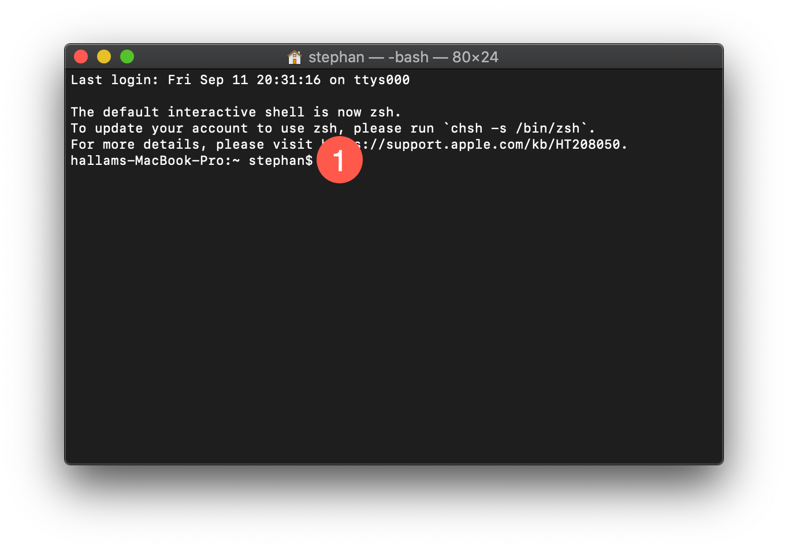

```{r echo = FALSE, include = FALSE}
#Reset wd to home
knitr::opts_knit$set(root.dir = '/Users/stephan')
library(educer)
# Helper function to set path to images to "/images" etc.
setup_resources()
```

## Overview
This tutorial provides a guided, hands-on introduction to Unix shell. After this tutorial, you will be able to:

- Apply fundamental commands.
- Navigate the file system of your computer.
- Identify the structure and components of Unix commands.
- Browse the documentation of commands.


## Before you start

Make sure you followed the setup instructions for you operating system ([macOS](https://educe-ubc.github.io/macos.html), [Linux](https://educe-ubc.github.io/linux.html), [Windows](https://educe-ubc.github.io/wsl.html)).  Whenever you are going to work with the Unix shell, open the "Terminal" (macOS/Linux) or "Windows Terminal" app (Windows). Also, on Windows, you will have to first start "Windows Subsystem for Linux" by entering `wsl` into the terminal.

A common point of confusion is that you will find many different terms used to refer to the Unix shell such as "command-line interface", "terminal", or "bash". For the purpose of this tutorial, these terms are interchangeable (although in actuality they all mean slightly different things).

Commands that you will have to enter into your terminal are in large grey boxes. Example outputs are in white boxes. Your outputs will most likely differ from the examples below.


## Command prompt

In your terminal, the line containing the `$` symbol is the command prompt {width=3%}. The data displayed in front of the `$` in your prompt might differ from the example below. Do not worry about any differences, prompts are often customized by the operating system or the user. The prompt might show you information such as:

- **Computer name and user ID** (sometimes before and after an `@` symbol; in the example below `hallams-MacBook-Pro` and `stephan`).
- **Working directory** (a new terminal usually opens your home directory, in general named the same as your username; the home directory can also be refered to with the shorthand `~`).



You enter commands after the `$` and as you execute (*i.e.* run) them, the prompt will not appear on a new line until your computer has completed the previous command(s). When it does, you know that the terminal is ready for you to input your next command. 


## Navigating your computer

### `pwd`

When you open a new terminal, you will automatically be in your home directory. To find out where this is, enter `pwd` which stands for **print working directory** and hit return. The output is a file path, i.e. a point in your file system, and tells you where your terminal is currently pointing to.

```{bash}
pwd
```

You can see here than I am in my home user directory `stephan`.


### `ls`

To view all the files and sub-directories in the current directory, use `ls` for **list**.

```{bash}
ls
```

You can see that my home directory has a number of things that all Macs will have (*e.g.* `Applications`, `Desktop`, etc.) as well as a number of things which are unique to my file system (*e.g.* `google-cloud-sdk`, `miniconda3`, etc.). Your list will be unique to your computer.

Depending on your operating system or personal settings, the output might be colour-formatted and include special symbols. Directories are often blue and end in `/`, symbolic links (like shortcuts) are teal and end in `@`, files are grey, etc.


### `cd`

So now that you've seen what directories exist in your home directory, you can move into another directory with `cd` for **change directory**. Let's move into the Desktop since everyone will have this directory. Note that the command line is *case sensitive* so Desktop =/= desktop. You can confirm that you've moved to a different directory by using `pwd` again.

```{bash}
cd Desktop
pwd
```


### `..`, `~`, `-` shortcuts

You now have a couple of options for getting back out of the Desktop. 

1. You can go **up one directory** using `cd ..` 
    - In this case, you would go back to your home directory since this is one up from the Desktop directory.
    - You can repeat this as many times as you want and continue to go up one directory at a time as shown.

```{bash}
pwd

cd ..
pwd

cd ..
pwd
```

```{r echo=FALSE}
#Reset wd to home
knitr::opts_knit$set(root.dir = '/')
```

2. You can go straight to the home directory from anywhere on your computer using `cd ~` (shorthand for your **home directory**).

No matter how many directories up or down you currently are, `~` will take you to your home directory. Alternatively, you can just use `cd` alone to go to your home directory.

3. You can go to the last previous directory with `-`.

```{bash}
pwd

cd ~
pwd

cd -
```


### Root directory

The directory that contains all other directories is called root and represented by `/`.

```{bash}
cd /
ls
```

After you had a look around return to your home directory.

```{r echo=FALSE}
#Reset wd to home
knitr::opts_knit$set(root.dir = '/Users/stephan')
```

### Tab completion

As file names or paths get longer, it becomes cumbersome to type them out. To make your life easier and prevent typos, you can use tab completion instead. This will fill in the rest of a directory or file name *if it is unique*.

For example, let's look at my home directory again.

```{bash}
ls
```

If I were to type `cd Desk` and then use the [tab], the terminal would automatically complete `Desktop/` because that is the only directory in the current folder that starts with `Desk`.

In contrast, if I tried `Do` [tab], the terminal would not know if I meant `Documents` or `Downloads`, which both exist in my home directory. In general, tab completion will fill in as much as it can until it needs more disambiguation. If you then press tab again, it will list in the terminal the current possible completions (*e.g.* `Documents` and `Downloads`). 


### `ls` options

When looking at the content of a directory it is often difficult to identify what names indicate files or directories. You can get additional information by using options specifically available for a given command. The simplest option starts with a `-` followed by a single character called a "flag".

For example, if you want to show all of the file type indicators, you would use `ls -F` (`F` in this case is the flag).

```{bash}
ls -F
```

Now you will see that everything in my home directory that are themselves directories end in `/`.


### `man`

You can learn more about flags or the general use of a command by looking up the **manual** of any command with `man`. For example, if you look up the manual of `pwd` with `man pwd`, you will see the following.

```{bash eval=FALSE}
man pwd
```

```{bash echo=FALSE}
# Reformat for rmd
man pwd | col -b
```

This is a text document with information on every possible modifier of the `pwd` command. There are manuals for all of the common commands.

Manuals are very comprehensive, large documents that make them often difficult to navigate. Here a few tips on how to use your <kbd>keyboard</kbd>:

| Action | <kbd>keyboard</kbd> | Description |
|--:|---|-------------|
| List shortcuts | <kbd>H</kbd>elp | For all keyboard shortcuts (including the examples below)|
| Jump to<br> beginning<br> or end | <br> <kbd>G</kbd><br> <kbd>Shift + G</kbd>| |
| Scroll up<br> down | <kbd>&#8593;</kbd> <br> <kbd>&#8595;</kbd> | |
| Page | <kbd>F</kbd>orward <br> <kbd>B</kbd>ackward | One screen at a time |
| Search | <kbd>/</kbd> <br> <kbd>Return</kbd> <br> <kbd>N</kbd>ext <br> <kbd>Shift + N</kbd> | Enter search mode then enter your search term (great for searching flags)<br> Execute search<br> Go to next instance<br> Go to previous instance |
| Exit manual | <kbd>Q</kbd>uit | |


#### Exiting command line

This concludes the main commands used to navigate a computer. Now you *could* end your terminal session by closing the window. However, this is not best practices and could cause issues if you are remotely logged into another machine.

It is best to officially exit the session with `exit`. This will save your history and safely disconnect you. Depending on your terminal app, the window will automatically close or remain open but disconnected.

```{bash}
exit
```


## Exercise

In a new terminal window on your computer:

Navigate to your `Desktop`. Create a new text file called `test.txt` by using the `touch` command. Copy this file to your `Downloads` folder.

- Use the manual to learn how `touch` works.
- If you do not have a `Desktop` or `Download` folder in your home directory, find out what Linux command to use to create them using Google-fu.
- Use a combination of the two approaches above to learn how to copy files.


## Additional resources

[Software Carpentry: The Unix Shell](http://swcarpentry.github.io/shell-novice/) is a great in-depth introduction to Unix shell if you want to learn more about this powerful tool.
